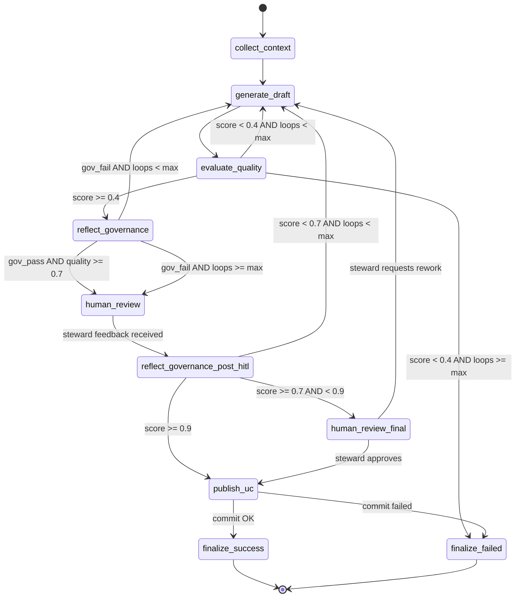

# Metadata Governance State Machine — LangGraph + AgentBricks

## Contexto

El sistema automatiza la generación, evaluación y publicación de metadatos funcionales para tablas del Unity Catalog, siguiendo los lineamientos de gobierno de metadatos de Pacífico (4 pilares: Claridad, Propósito, Nivel de Detalle, Contexto). El feedback del `plan.md` propone un sistema extremadamente complejo; **esta implementación prioriza un MVP funcional, resiliente, escalable y explicable**, que pueda evolucionar incrementalmente.

### Filosofía de diseño

| Principio del feedback | Cómo lo abordamos | Complejidad |
|---|---|---|
| Estado explícito (`MetadataAgentState`) | ✅ TypedDict completo con `Annotated` reducers | Incluido |
| Separación validación/persistencia | ✅ Nodos separados: `evaluate_quality` → `reflect_governance` → `publish_uc` | Incluido |
| Loop control (retry/max loops) | ✅ `retry_count`, `max_retries`, `loop_count`, `max_loops` en estado | Incluido |
| Audit trail | ✅ Lista `audit_log` en estado + `@mlflow.trace` en cada nodo | Incluido |
| Evidence collection | ⚠️ Simplificado: se usa `get_table_info` + `information_schema` como evidencia base | Simplificado |
| Idempotency / version guard | ⚠️ Diferido a v2 — el MVP verifica existencia de comments antes de escribir | Diferido |
| Context builder separado | ⚠️ Fusionado con el nodo `collect_context` como paso determinista | Simplificado |
| Pre-commit control separado | ⚠️ Cubierto por `reflect_governance` como policy check | Simplificado |

---

## Arquitectura del Flujo (State Machine)



### Thresholds definidos (basados en lineamientos)

| Threshold | Valor | Criterio |
|---|---|---|
| `AUTO_REFLEXION_CEILING` | `< 0.4` | Reflexión automática sin intervención humana |
| `HITL_TRIGGER` | `>= 0.7` | Escalar a Data Steward para revisión |
| `PUBLISH_READY` | `>= 0.9` | Publicación directa tras validación de governance post-HITL |
| `MAX_REFLEXION_LOOPS` | `3` | Máximo de ciclos de reflexión automática |
| `MAX_RETRIES` | `2` | Máximo reintentos de publicación a UC |

### Criterios de evaluación de calidad (derivados de los 4 pilares)

Cada pilar se evalúa en escala 0-1:

1. **Claridad y Comprensión** (25%): ¿La definición es clara, precisa, sin ambigüedades?
2. **Propósito del Dato** (25%): ¿Se describe el uso de negocio y procesos que habilita?
3. **Nivel de Detalle** (25%): ¿Incluye alcance, excepciones, reglas relevantes?
4. **Contexto y Relacionamiento** (25%): ¿Describe fuentes, relaciones, integración en ecosistema?

El `quality_score` = promedio ponderado de los 4 pilares.

---

## Proposed Changes

### Estructura de archivos

```
pacifico-agents/
├── config/
│   ├── __init__.py
│   ├── settings.py              # Thresholds, model config, prompts base
│   └── governance_pillars.py    # Pilares y criterios de evaluación
├── state/
│   ├── __init__.py
│   └── schema.py                # MetadataAgentState (TypedDict)
├── tools/
│   ├── __init__.py
│   └── unity_catalog.py         # Tools: get_table_info, get_columns, publish_comments
├── nodes/
│   ├── __init__.py
│   ├── collect_context.py       # Nodo determinista: recolectar evidencia
│   ├── generate_draft.py        # Nodo cognitivo: generar draft de metadatos
│   ├── evaluate_quality.py      # Nodo cognitivo: evaluar calidad del draft
│   ├── reflect_governance.py    # Nodo cognitivo: reflexión de governance
│   ├── human_review.py          # Nodo HITL: interrupt para Data Steward
│   ├── publish_uc.py            # Nodo determinista: publicar a UC
│   └── finalize.py              # Nodos terminales: success / failed
├── routers/
│   ├── __init__.py
│   └── decisions.py             # Funciones de routing condicional
├── graph/
│   ├── __init__.py
│   └── builder.py               # Construcción del StateGraph
├── agent.py                     # ResponsesAgent wrapper (AgentBricks/MLflow)
├── prompts/
│   ├── __init__.py
│   ├── draft_generation.py      # Prompt para generar draft
│   ├── quality_evaluation.py    # Prompt para evaluar calidad
│   └── governance_reflection.py # Prompt para reflexión governance
├── lineamiento_gobierno_metadatos.md  # [EXISTING]
├── plan.md                            # [EXISTING]
├── tentative_tools.md                 # [EXISTING - se actualizará]
└── requirements.txt
```

---

### Config

#### [NEW] [settings.py](file:///c:/Users/Jean_/Desktop/archivos/proyectos/pacifico/pacifico-agents/config/settings.py)

Contiene todas las constantes configurables del sistema:
- Thresholds de calidad (`AUTO_REFLEXION_CEILING`, `HITL_TRIGGER`, `PUBLISH_READY`)
- Límites de loops (`MAX_REFLEXION_LOOPS`, `MAX_RETRIES`)
- Configuración del modelo LLM (endpoint de Databricks Foundation Model)
- Pesos de pilares de governance

#### [NEW] [governance_pillars.py](file:///c:/Users/Jean_/Desktop/archivos/proyectos/pacifico/pacifico-agents/config/governance_pillars.py)

Define la estructura de los 4 pilares con:
- Nombre, descripción, peso
- Preguntas clave por tipo de activo (tabla, campo)
- Criterios de evaluación específicos por pilar

---

### State

#### [NEW] [schema.py](file:///c:/Users/Jean_/Desktop/archivos/proyectos/pacifico/pacifico-agents/state/schema.py)

`MetadataAgentState` como `TypedDict` con `Annotated` reducers de LangGraph:

```python
class MetadataAgentState(TypedDict):
    # Identidad
    request_id: str
    asset_fqn: str                          # catalog.schema.table
    
    # Contexto recolectado (evidencia)
    table_info: dict                        # schema, columns, existing comments
    column_details: list[dict]              # nombre, tipo, comment actual
    
    # Draft generado
    draft_table_comment: str
    draft_column_comments: dict[str, str]   # {col_name: comment}
    
    # Evaluación
    quality_score: float
    pillar_scores: dict[str, float]         # {pilar: score}
    quality_findings: list[str]
    
    # Governance
    governance_status: str                  # pass | fail | needs_review
    governance_findings: list[str]
    
    # HITL
    human_feedback: str | None
    human_decision: str | None              # approve | reject | rework
    
    # Control operacional
    workflow_status: str
    loop_count: Annotated[int, operator.add]
    retry_count: int
    
    # Auditoría
    audit_log: Annotated[list[dict], operator.add]
```

---

### Tools (Unity Catalog)

#### [NEW] [unity_catalog.py](file:///c:/Users/Jean_/Desktop/archivos/proyectos/pacifico/pacifico-agents/tools/unity_catalog.py)

Tools que interactúan con Databricks/Unity Catalog:

1. **`get_table_info(fqn: str) -> dict`**: Usa `WorkspaceClient().tables.get()` para obtener metadata técnica de la tabla (schema, columnas, tipos, comments existentes).

2. **`get_column_details(fqn: str) -> list[dict]`**: Ejecuta `DESCRIBE TABLE EXTENDED` via Spark SQL para obtener detalles de columnas.

3. **`publish_table_comment(fqn: str, comment: str) -> dict`**: Ejecuta `COMMENT ON TABLE {fqn} IS '{comment}'`.

4. **`publish_column_comments(fqn: str, comments: dict) -> dict`**: Ejecuta `ALTER TABLE {fqn} ALTER COLUMN {col} COMMENT '{comment}'` para cada columna.

> [!NOTE]
> Estas tools se ejecutan en el contexto de Databricks workspace. Para desarrollo local se proveerán mocks.

---

### Nodos

#### [NEW] [collect_context.py](file:///c:/Users/Jean_/Desktop/archivos/proyectos/pacifico/pacifico-agents/nodes/collect_context.py)

**Tipo**: Determinista  
**Función**: Recolecta evidencia técnica de la tabla usando las tools de UC.  
**Input**: `asset_fqn`  
**Output**: `table_info`, `column_details`, `audit_log` entry  

#### [NEW] [generate_draft.py](file:///c:/Users/Jean_/Desktop/archivos/proyectos/pacifico/pacifico-agents/nodes/generate_draft.py)

**Tipo**: Cognitivo (LLM)  
**Función**: Genera draft de metadatos funcionales para tabla y columnas siguiendo los 4 pilares.  
**Input**: `table_info`, `column_details`, `quality_findings` (si es rework), `human_feedback` (si viene de HITL)  
**Output**: `draft_table_comment`, `draft_column_comments`, `audit_log` entry  
**Prompt**: Incluye los lineamientos de gobierno, los ejemplos del documento, y las preguntas clave por tipo de activo.

#### [NEW] [evaluate_quality.py](file:///c:/Users/Jean_/Desktop/archivos/proyectos/pacifico/pacifico-agents/nodes/evaluate_quality.py)

**Tipo**: Cognitivo (LLM como juez)  
**Función**: Evalúa el draft contra los 4 pilares, genera score por pilar y score global.  
**Input**: `draft_table_comment`, `draft_column_comments`, `table_info`  
**Output**: `quality_score`, `pillar_scores`, `quality_findings`, `audit_log` entry  
**Patrón**: LLM-as-a-Judge con output estructurado (JSON)

#### [NEW] [reflect_governance.py](file:///c:/Users/Jean_/Desktop/archivos/proyectos/pacifico/pacifico-agents/nodes/reflect_governance.py)

**Tipo**: Cognitivo (LLM reflexivo)  
**Función**: Valida compliance contra los principios de gobierno (unicidad, colaboración, trazabilidad, clasificación correcta).  
**Input**: `draft_table_comment`, `draft_column_comments`, `quality_score`, `pillar_scores`  
**Output**: `governance_status`, `governance_findings`, `audit_log` entry  

#### [NEW] [human_review.py](file:///c:/Users/Jean_/Desktop/archivos/proyectos/pacifico/pacifico-agents/nodes/human_review.py)

**Tipo**: HITL (usa `interrupt()` de LangGraph)  
**Función**: Pausa el grafo y presenta al Data Steward el draft con scores y findings para revisión.  
**Input**: Todo el estado relevante  
**Output**: `human_feedback`, `human_decision`, `audit_log` entry  
**Patrón**: `interrupt()` → el steward responde con `Command(resume={"decision": "approve|reject|rework", "feedback": "..."})`

#### [NEW] [publish_uc.py](file:///c:/Users/Jean_/Desktop/archivos/proyectos/pacifico/pacifico-agents/nodes/publish_uc.py)

**Tipo**: Determinista  
**Función**: Publica los comentarios finales al Unity Catalog usando `COMMENT ON TABLE` y `ALTER TABLE ALTER COLUMN COMMENT`.  
**Input**: `draft_table_comment`, `draft_column_comments`, `asset_fqn`  
**Output**: `workflow_status` = "published" o error, `audit_log` entry  

#### [NEW] [finalize.py](file:///c:/Users/Jean_/Desktop/archivos/proyectos/pacifico/pacifico-agents/nodes/finalize.py)

**Tipo**: Determinista  
**Funciones**: 
- `finalize_success`: Marca el workflow como completado exitosamente.
- `finalize_failed`: Marca como fallido con razón.

---

### Routers

#### [NEW] [decisions.py](file:///c:/Users/Jean_/Desktop/archivos/proyectos/pacifico/pacifico-agents/routers/decisions.py)

Funciones de routing puro (sin side effects):

1. **`route_after_quality(state)`**: 
   - `score < 0.4 AND loop_count < MAX_LOOPS` → `generate_draft` (reflexión automática)
   - `score < 0.4 AND loop_count >= MAX_LOOPS` → `finalize_failed`
   - `score >= 0.4` → `reflect_governance`

2. **`route_after_governance(state)`**:
   - `governance_status == "pass" AND quality_score >= 0.7` → `human_review` (HITL trigger)
   - `governance_status == "fail" AND loop_count < MAX_LOOPS` → `generate_draft`
   - `governance_status == "fail" AND loop_count >= MAX_LOOPS` → `human_review`
   - `governance_status == "needs_review"` → `human_review`

3. **`route_after_hitl(state)`**:
   - `human_decision == "approve"` → `reflect_governance_post_hitl`
   - `human_decision == "rework"` → `generate_draft`
   - `human_decision == "reject"` → `finalize_failed`

4. **`route_after_post_hitl_governance(state)`**:
   - `quality_score >= 0.9` → `publish_uc`
   - `quality_score >= 0.7 AND < 0.9` → `human_review_final`
   - `quality_score < 0.7` → `generate_draft`

5. **`route_after_publish(state)`**:
   - `workflow_status == "published"` → `finalize_success`
   - `workflow_status == "error"` → `finalize_failed`

---

### Graph Builder

#### [NEW] [builder.py](file:///c:/Users/Jean_/Desktop/archivos/proyectos/pacifico/pacifico-agents/graph/builder.py)

Ensambla el `StateGraph` completo con:
- Todos los nodos registrados
- Edges deterministas (START → collect_context → generate_draft → evaluate_quality)
- Conditional edges usando los routers
- Compilación con `MemorySaver` checkpointer para HITL
- Decorador `@mlflow.trace` implícito via `mlflow.langchain.autolog()`

---

### AgentBricks Wrapper

#### [NEW] [agent.py](file:///c:/Users/Jean_/Desktop/archivos/proyectos/pacifico/pacifico-agents/agent.py)

Wrapper `ResponsesAgent` de MLflow para desplegar en Databricks Model Serving:

```python
import mlflow
from mlflow.pyfunc import ResponsesAgent
from mlflow.types.responses import ResponsesAgentRequest, ResponsesAgentResponse

mlflow.langchain.autolog()

class MetadataGovernanceAgent(ResponsesAgent):
    def __init__(self):
        from graph.builder import build_graph
        self.graph = build_graph()
    
    def predict(self, request: ResponsesAgentRequest) -> ResponsesAgentResponse:
        # Parsear input: extraer catalog.schema.table
        # Invocar graph con estado inicial
        # Retornar respuesta formateada
        ...
    
    def predict_stream(self, request):
        # Streaming de eventos del grafo
        ...

mlflow.pyfunc.set_model(MetadataGovernanceAgent())
```

---

### Prompts

#### [NEW] [draft_generation.py](file:///c:/Users/Jean_/Desktop/archivos/proyectos/pacifico/pacifico-agents/prompts/draft_generation.py)

System prompt que incluye:
- Los 4 pilares completos con sus preguntas clave
- Ejemplos del lineamiento (ScoreBuro, Feature Store, etc.)
- Instrucciones de formato y estilo
- Contexto técnico de la tabla como input

#### [NEW] [quality_evaluation.py](file:///c:/Users/Jean_/Desktop/archivos/proyectos/pacifico/pacifico-agents/prompts/quality_evaluation.py)

System prompt para el evaluador LLM-as-a-Judge:
- Rubric explícita por pilar (0-1)
- Output JSON estructurado con scores y findings
- Criterios de qué constituye un "finding" vs "pass"

#### [NEW] [governance_reflection.py](file:///c:/Users/Jean_/Desktop/archivos/proyectos/pacifico/pacifico-agents/prompts/governance_reflection.py)

System prompt para el agente de reflexión governance:
- Los 7 principios de gobierno como checklist
- Validación de naming, ownership, clasificación
- Output: status + findings

---

## User Review Required

> [!IMPORTANT]
> **Modelo LLM**: El plan asume usar el Foundation Model endpoint de Databricks (ej. `databricks-meta-llama-3-1-70b-instruct` o `databricks-claude-sonnet`). ¿Cuál es el endpoint/modelo disponible en tu workspace?

> [!IMPORTANT]
> **Ejecución Spark SQL**: Las tools de UC usan `spark.sql()` para publicar comentarios. Esto requiere ejecutarse en un Databricks notebook o cluster. ¿El agente se ejecutará como notebook job, o como Model Serving endpoint? Si es endpoint, las tools de escritura necesitarán usar la REST API o el SDK en lugar de Spark SQL.

> [!WARNING]
> **`tentative_tools.md` vacío**: El archivo está vacío. El plan asume que las tools necesarias son las de UC (`get_table_info`, `publish_comments`). Si tenías herramientas adicionales en mente (profiling, lineage, glossary), por favor indícalas.

## Open Questions

1. **¿Hay un glosario de negocio disponible** que el agente deba consultar para grounding de términos? El feedback sugiere "glossary grounding" pero no está claro si existe un glosario digital accesible.

2. **¿Se necesita soporte para vistas y columnas individuales** en v1, o solo tablas completas (tabla + todas sus columnas)?

3. **¿El Data Steward interactuará a través de** la AI Playground de Databricks, un notebook, o una UI personalizada? Esto define cómo se implementa el `interrupt()` en producción.

---

## Verification Plan

### Automated Tests

```bash
# Unit tests para routers (lógica de decisión pura)
python -m pytest tests/test_routers.py -v

# Unit tests para state schema
python -m pytest tests/test_state.py -v

# Integration test del grafo completo con mocks
python -m pytest tests/test_graph_integration.py -v
```

### Manual Verification

1. **Flujo completo local**: Ejecutar el grafo con tabla mock, verificar que traverse todos los nodos esperados
2. **HITL simulation**: Verificar que el `interrupt()` pausa correctamente y el `Command(resume=...)` reanuda
3. **Boundary testing**: Probar con scores en los límites (0.39, 0.4, 0.69, 0.7, 0.89, 0.9) para verificar routing
4. **Audit log**: Verificar que cada paso genera una entrada de auditoría completa
5. **MLflow tracing**: Verificar que `mlflow.langchain.autolog()` captura traces del grafo completo

### Databricks Verification (post-deploy)

1. Ejecutar contra una tabla real del Unity Catalog
2. Verificar que los comentarios se publican correctamente
3. Validar que los traces aparecen en MLflow UI
4. Probar el wrapper `ResponsesAgent` en AI Playground