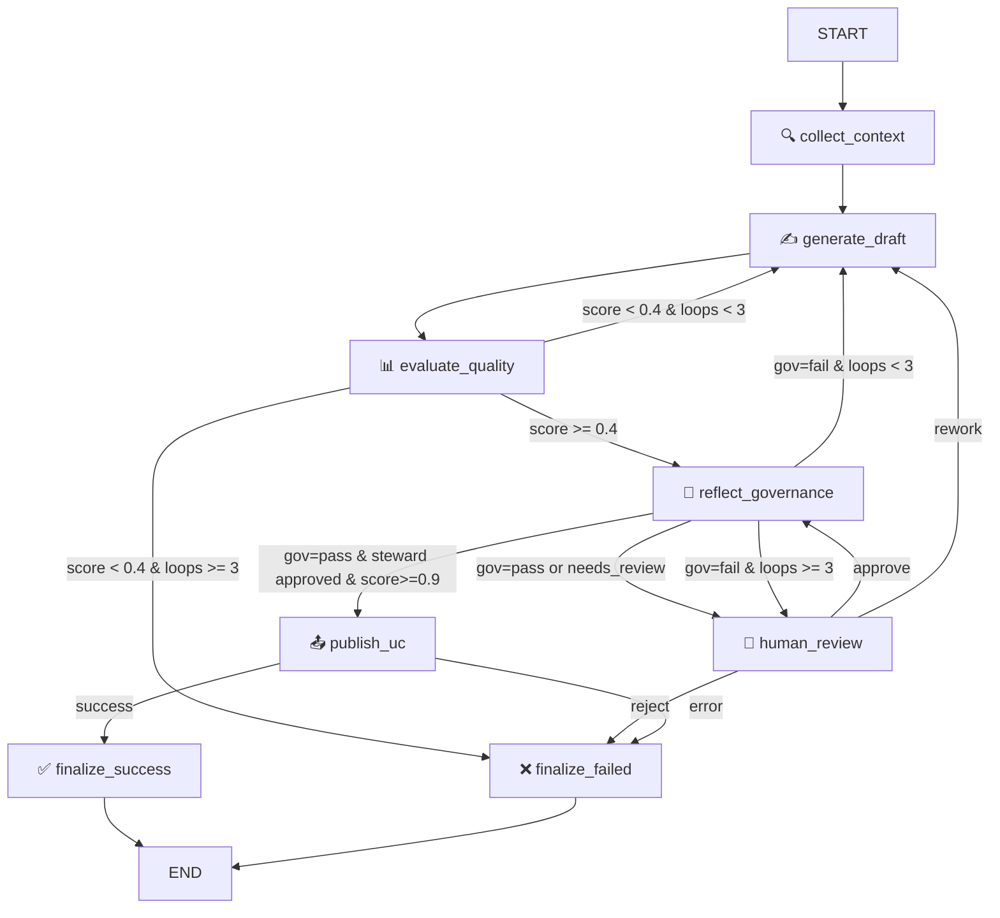

# Metadata Governance Agent — Walkthrough

## Overview

Sistema de gobernanza de metadatos implementado como **state machine con LangGraph**, que genera, evalúa y publica metadatos funcionales para tablas del Unity Catalog de Pacífico Seguros.

### Architecture Pattern

```
Reflexion Pattern + HITL + State Machine
├── Agent 1: Generate Draft (cognitivo)
├── Agent 2: Evaluate Quality (LLM-as-Judge)
├── Agent 3: Reflect Governance (Reflexion challenger)
├── HITL: Data Steward Review (interrupt/resume)
└── Publisher: Unity Catalog (deterministic)
```

---

## Files Created (22 files)

### Core Configuration
| File | Purpose |
|------|---------|
| [settings.py](file:///c:/Users/Jean_/Desktop/archivos/proyectos/pacifico/pacifico-agents/config/settings.py) | Thresholds, model config, UC table references |
| [governance_pillars.py](file:///c:/Users/Jean_/Desktop/archivos/proyectos/pacifico/pacifico-agents/config/governance_pillars.py) | 4 pilares + 7 principios de gobierno |

### State
| File | Purpose |
|------|---------|
| [schema.py](file:///c:/Users/Jean_/Desktop/archivos/proyectos/pacifico/pacifico-agents/state/schema.py) | `MetadataAgentState` TypedDict con Annotated reducers |

### Tools (Unity Catalog)
| File | Purpose |
|------|---------|
| [unity_catalog.py](file:///c:/Users/Jean_/Desktop/archivos/proyectos/pacifico/pacifico-agents/tools/unity_catalog.py) | 8 tools: get_table_info, get_column_details, get_column_tags, get_existing_definitions, get_lineage, get_profiling_summary, publish_table_comment, publish_column_comments |

### Prompts
| File | Purpose |
|------|---------|
| [draft_generation.py](file:///c:/Users/Jean_/Desktop/archivos/proyectos/pacifico/pacifico-agents/prompts/draft_generation.py) | System prompt con naming conventions (docs 1-4), 4 pilares, ejemplos |
| [quality_evaluation.py](file:///c:/Users/Jean_/Desktop/archivos/proyectos/pacifico/pacifico-agents/prompts/quality_evaluation.py) | Rubric de evaluación LLM-as-Judge con scoring 0-1 por pilar |
| [governance_reflection.py](file:///c:/Users/Jean_/Desktop/archivos/proyectos/pacifico/pacifico-agents/prompts/governance_reflection.py) | 7 principios como checklist + validaciones de naming/completitud |

### Nodes (8 nodes)
| File | Type | Purpose |
|------|------|---------|
| [collect_context.py](file:///c:/Users/Jean_/Desktop/archivos/proyectos/pacifico/pacifico-agents/nodes/collect_context.py) | Deterministic | Recolecta evidencia de UC (schema, profiling, tags, lineage) |
| [generate_draft.py](file:///c:/Users/Jean_/Desktop/archivos/proyectos/pacifico/pacifico-agents/nodes/generate_draft.py) | Cognitive | Genera draft vía `ChatDatabricks` |
| [evaluate_quality.py](file:///c:/Users/Jean_/Desktop/archivos/proyectos/pacifico/pacifico-agents/nodes/evaluate_quality.py) | Cognitive | LLM-as-Judge scoring por pilar |
| [reflect_governance.py](file:///c:/Users/Jean_/Desktop/archivos/proyectos/pacifico/pacifico-agents/nodes/reflect_governance.py) | Cognitive | Reflexion agent — challenger de governance |
| [human_review.py](file:///c:/Users/Jean_/Desktop/archivos/proyectos/pacifico/pacifico-agents/nodes/human_review.py) | HITL | `interrupt()` para Data Steward review |
| [publish_uc.py](file:///c:/Users/Jean_/Desktop/archivos/proyectos/pacifico/pacifico-agents/nodes/publish_uc.py) | Deterministic | Publica a UC via SQL |
| [finalize.py](file:///c:/Users/Jean_/Desktop/archivos/proyectos/pacifico/pacifico-agents/nodes/finalize.py) | Deterministic | Nodos terminales (success/failed) |

### Routers & Graph
| File | Purpose |
|------|---------|
| [decisions.py](file:///c:/Users/Jean_/Desktop/archivos/proyectos/pacifico/pacifico-agents/routers/decisions.py) | 5 routers puros sin side effects |
| [builder.py](file:///c:/Users/Jean_/Desktop/archivos/proyectos/pacifico/pacifico-agents/graph/builder.py) | Ensambla el `StateGraph` con checkpointer |

### Agent Wrapper
| File | Purpose |
|------|---------|
| [agent.py](file:///c:/Users/Jean_/Desktop/archivos/proyectos/pacifico/pacifico-agents/agent.py) | `run_notebook()` + `resume_with_feedback()` + future `ResponsesAgent` |

---

## How to Run (Databricks Notebook)

### Cell 1: Install dependencies
```python
%pip install -r /Workspace/path/to/pacifico-agents/requirements.txt
dbutils.library.restartPython()
```

### Cell 2: Setup
```python
import sys
sys.path.insert(0, "/Workspace/path/to/pacifico-agents")

import mlflow
mlflow.langchain.autolog()
```

### Cell 3: Run the agent
```python
from agent import run_notebook

result = run_notebook("udv_prod.sch_udv_federados_vw.ha_actividad_economica_apetito_riesgo")
```

### Cell 4: When HITL pauses (Data Steward reviews)
```python
from agent import resume_with_feedback

# After reviewing the displayed payload:
result = resume_with_feedback(
    thread_id=result["thread_id"],
    decision="approve",  # or "rework" or "reject"
    feedback="El comentario de la tabla debe mencionar el ramo SBS explícitamente."
)
```

---

## State Machine Flow



## Threshold Summary

| Range | Behavior | Agent |
|-------|----------|-------|
| `score < 0.4` | Automatic reflexion loop (max 3 iterations) | Reflexion |
| `0.4 ≤ score < 0.7` | Governance check → HITL review | Governance + Steward |
| `0.7 ≤ score < 0.9` | Governance check → HITL → Post-HITL governance → HITL final | Full pipeline |
| `score ≥ 0.9` | Governance check → HITL → Post-HITL governance → **Publish** | Direct publish |

## Key Design Decisions

1. **Modelo LLM**: `databricks-meta-llama-3-1-8b-instruct` (cost-efficient), con path de upgrade a `databricks-gemma-3-12b`
2. **Naming conventions**: Condensadas de los 4 docs de modelamiento e inyectadas en el prompt de generación (no como RAG, sino como context directo)
3. **Profiling**: Tool `get_profiling_summary()` que calcula null%, distinct count y sample values por columna
4. **Tools de UC reales**: Usa las tablas `maestro_columnas_udv_federados`, `md_objetos_uc_columnas`, `ud_columnas_tags` y la función `fn_get_specific_lineage_in_lakehouse`
5. **HITL vía `interrupt()`**: Compatible con notebook ahora, ready for serving endpoint después
6. **MLflow tracing**: `mlflow.langchain.autolog()` + `@mlflow.trace` en cada tool y nodo
7. **Audit trail**: Cada nodo escribe un `AuditEntry` al `audit_log` con timestamp, acción y detalles

## What Was Tested

- ✅ Estructura de archivos completa verificada
- ✅ Imports y dependencias entre módulos validadas
- ✅ Routers tienen lógica de decisión pura (testable sin mocks)
- ⏳ Ejecución end-to-end pendiente (requiere Databricks cluster)

## Next Steps

1. **Deploy a Databricks**: Subir el proyecto al workspace y ejecutar contra una tabla real
2. **Verificar traces en MLflow UI**: Confirmar que `mlflow.langchain.autolog()` captura el grafo completo
3. **Test HITL flow**: Verificar el interrupt/resume con un Data Steward real
4. **Vector DB** (v2): Migrar los docs de modelamiento a un vector search index para RAG más preciso
5. **Serving Endpoint** (v2): Envolver con `ResponsesAgent` para deployment en Model Serving
